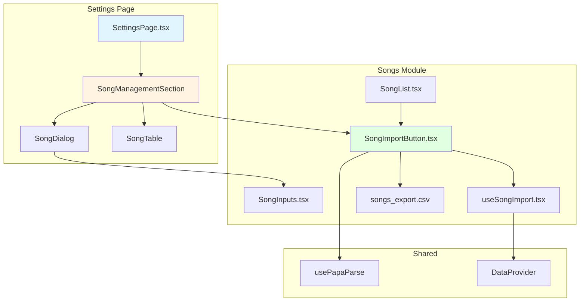
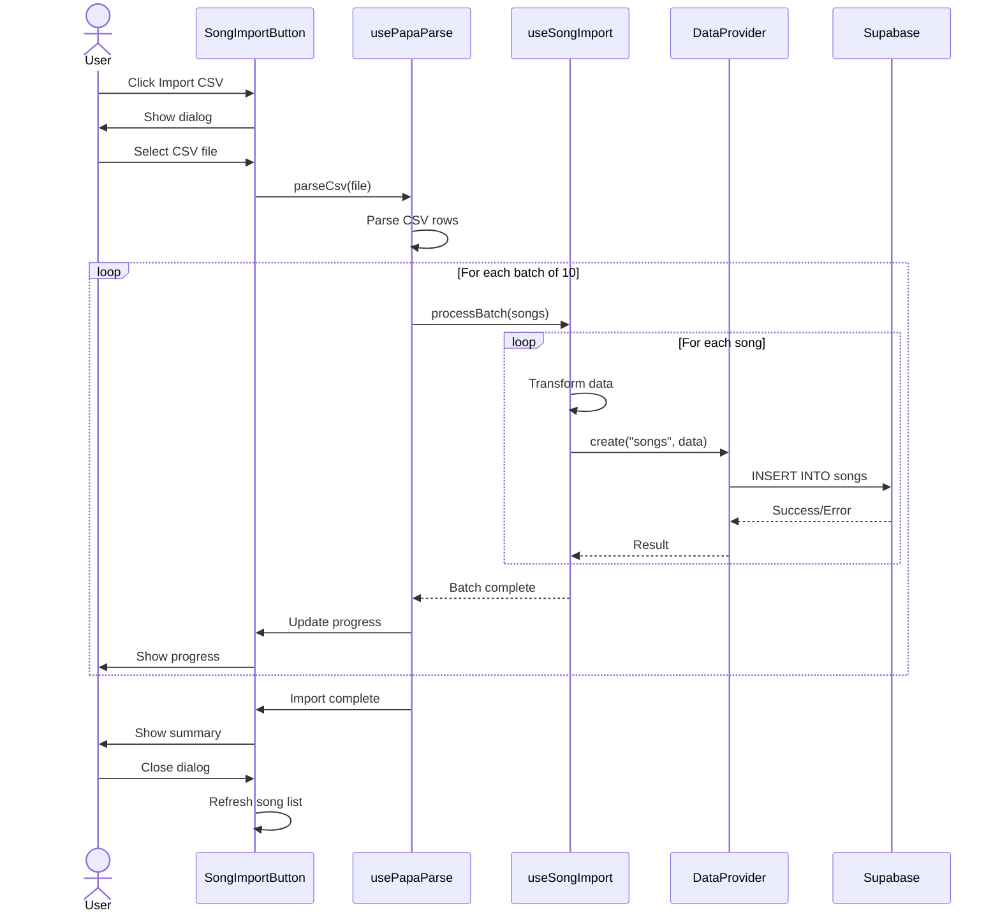
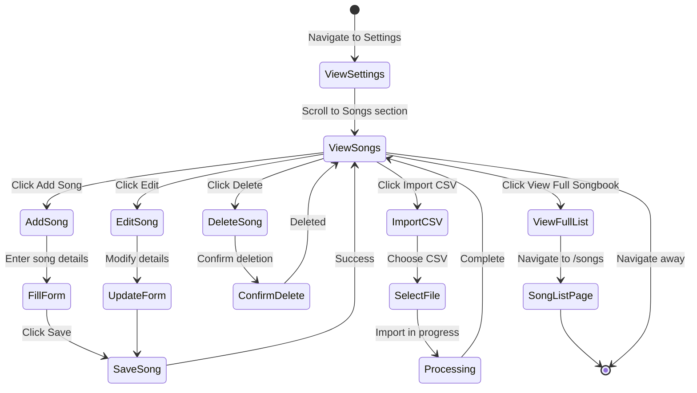

# Song Management in Settings Page - Implementation Plan

## Overview

Add comprehensive song management capabilities to the Band CRM settings page, including:
1. **Settings Page Integration**: Add a "Songs" section for managing the songbook
2. **Bulk Import**: Support CSV import for songs via the existing Import Data feature

## Current State Analysis

### Existing Components
- **Settings Page** ([`src/components/atomic-crm/settings/SettingsPage.tsx`](src/components/atomic-crm/settings/SettingsPage.tsx:1)): Currently manages Branding, Companies, Deals, Notes, and Tasks
- **Song Components**: Full CRUD already exists in [`src/components/atomic-crm/songs/`](src/components/atomic-crm/songs/)
  - [`SongList.tsx`](src/components/atomic-crm/songs/SongList.tsx:1): Grid-based song list with filters
  - [`SongCreate.tsx`](src/components/atomic-crm/songs/SongCreate.tsx:1): Song creation form
  - [`SongEdit.tsx`](src/components/atomic-crm/songs/SongEdit.tsx:1): Song editing form
  - [`SongInputs.tsx`](src/components/atomic-crm/songs/SongInputs.tsx:1): Reusable form inputs
- **Import Infrastructure**: 
  - [`ContactImportButton.tsx`](src/components/atomic-crm/contacts/ContactImportButton.tsx:1): CSV import with PapaParse
  - [`useContactImport.tsx`](src/components/atomic-crm/contacts/useContactImport.tsx:1): Batch processing hook
  - [`ImportPage.tsx`](src/components/atomic-crm/misc/ImportPage.tsx:1): JSON-based bulk import

### Database Schema
From [`supabase/migrations/20260318113800_create_songs.sql`](supabase/migrations/20260318113800_create_songs.sql:1):
```sql
CREATE TABLE songs (
  id          bigint PRIMARY KEY,
  title       text NOT NULL,
  artist      text,
  key         text,
  tempo       integer,
  duration    integer,
  genre       text,
  notes       text,
  lyrics_url  text,
  chart_url   text,
  tags        text[],
  active      boolean DEFAULT true,
  created_at  timestamptz,
  updated_at  timestamptz
);
```

## Architecture Decisions

### 1. Settings Page Integration Approach

**Decision**: Add an inline song management section to the Settings page rather than just linking to the existing Songs list page.

**Rationale**:
- Consistent with how other entities (deal stages, task types, note statuses) are managed in Settings
- Provides a centralized configuration experience
- Settings page already has patterns for managing lists of items with [`ArrayInput`](src/components/atomic-crm/settings/SettingsPage.tsx:236) and [`SimpleFormIterator`](src/components/atomic-crm/settings/SettingsPage.tsx:240)
- However, songs are more complex than simple label/value pairs, so we'll use a custom table-based UI

**Implementation Pattern**:
- Add "Songs" to the [`SECTIONS`](src/components/atomic-crm/settings/SettingsPage.tsx:22) array
- Create a new `SongManagementSection` component within SettingsPage
- Use [`useGetList`](src/components/atomic-crm/settings/SettingsPage.tsx:153) to fetch songs
- Provide inline add/edit/delete actions using dialogs
- Include the import button in this section

### 2. Bulk Import Strategy

**Decision**: Support CSV import for songs (similar to contacts) rather than extending the JSON import.

**Rationale**:
- CSV is more user-friendly for bulk song data entry
- Existing [`ContactImportButton`](src/components/atomic-crm/contacts/ContactImportButton.tsx:1) provides a proven pattern
- Musicians are more likely to maintain song lists in spreadsheets
- The JSON import ([`ImportPage.tsx`](src/components/atomic-crm/misc/ImportPage.tsx:1)) is designed for full CRM data migration, not ongoing song management

**Implementation Pattern**:
- Create [`songs_export.csv`](src/components/atomic-crm/songs/) sample file
- Create [`useSongImport.tsx`](src/components/atomic-crm/songs/) hook (similar to [`useContactImport`](src/components/atomic-crm/contacts/useContactImport.tsx:1))
- Create [`SongImportButton.tsx`](src/components/atomic-crm/songs/) component
- Add import button to both:
  1. Settings page Songs section
  2. Main Songs list page ([`SongList.tsx`](src/components/atomic-crm/songs/SongList.tsx:47))

## Implementation Plan

### Phase 1: CSV Import Infrastructure

#### 1.1 Create Sample CSV File
**File**: `src/components/atomic-crm/songs/songs_export.csv`

**Content Structure**:
```csv
title,artist,key,tempo,duration,genre,notes,lyrics_url,chart_url,tags,active
```

**Fields**:
- `title` (required): Song title
- `artist`: Artist/composer name
- `key`: Musical key (C, D, Em, F#, etc.)
- `tempo`: BPM (integer)
- `duration`: Duration in seconds (integer)
- `genre`: Genre category
- `notes`: Free-text notes
- `lyrics_url`: URL to lyrics
- `chart_url`: URL to sheet music/charts
- `tags`: Comma-separated tags (e.g., "wedding,upbeat,slow")
- `active`: Boolean (true/false, defaults to true)

**Sample Data** (3-5 realistic examples):
```csv
Sweet Caroline,Neil Diamond,C,140,203,Pop,Crowd favorite,https://example.com/lyrics,https://example.com/chart,"wedding,singalong",true
Superstition,Stevie Wonder,Eb,100,245,Funk,Clavinet intro,"","","funk,groove",true
```

#### 1.2 Create useSongImport Hook
**File**: `src/components/atomic-crm/songs/useSongImport.tsx`

**Pattern**: Follow [`useContactImport.tsx`](src/components/atomic-crm/contacts/useContactImport.tsx:1)

**Key Differences**:
- No foreign key lookups needed (songs are standalone entities)
- Parse `tags` string into array: `tags?.split(",")?.map(t => t.trim())?.filter(t => t) ?? []`
- Parse `active` as boolean with default true
- Parse `tempo` and `duration` as integers
- Set `created_at` timestamp

**Type Definition**:
```typescript
export type SongImportSchema = {
  title: string;
  artist: string;
  key: string;
  tempo: string;
  duration: string;
  genre: string;
  notes: string;
  lyrics_url: string;
  chart_url: string;
  tags: string;
  active: string;
};
```

**Processing Logic**:
```typescript
const processBatch = async (batch: SongImportSchema[]) => {
  await Promise.all(
    batch.map(async (row) => {
      const tags = row.tags
        ?.split(",")
        ?.map((t) => t.trim())
        ?.filter((t) => t) ?? [];
      
      return dataProvider.create("songs", {
        data: {
          title: row.title,
          artist: row.artist || null,
          key: row.key || null,
          tempo: row.tempo ? parseInt(row.tempo, 10) : null,
          duration: row.duration ? parseInt(row.duration, 10) : null,
          genre: row.genre || null,
          notes: row.notes || null,
          lyrics_url: row.lyrics_url || null,
          chart_url: row.chart_url || null,
          tags: tags.length > 0 ? tags : null,
          active: row.active !== "false",
          created_at: new Date().toISOString(),
        },
      });
    })
  );
};
```

#### 1.3 Create SongImportButton Component
**File**: `src/components/atomic-crm/songs/SongImportButton.tsx`

**Pattern**: Clone [`ContactImportButton.tsx`](src/components/atomic-crm/contacts/ContactImportButton.tsx:1)

**Changes**:
- Import `useSongImport` instead of `useContactImport`
- Import sample CSV: `import * as sampleCsv from "./songs_export.csv?raw"`
- Update dialog title: "Import Songs"
- Update labels: "songs" instead of "contacts"
- Update sample file name: `crm_songs_sample.csv`

**Component Structure**:
```typescript
export const SongImportButton = () => {
  const [modalOpen, setModalOpen] = useState(false);
  // ... button and dialog
};

export function SongImportDialog({ open, onClose }) {
  const refresh = useRefresh();
  const processBatch = useSongImport();
  const { importer, parseCsv, reset } = usePapaParse<SongImportSchema>({
    batchSize: 10,
    processBatch,
  });
  // ... dialog UI with progress tracking
}
```

#### 1.4 Update Songs Index
**File**: `src/components/atomic-crm/songs/index.ts`

Add export:
```typescript
export { SongImportButton } from "./SongImportButton";
```

### Phase 2: Settings Page Integration

#### 2.1 Add Songs Section to Navigation
**File**: `src/components/atomic-crm/settings/SettingsPage.tsx`

Update [`SECTIONS`](src/components/atomic-crm/settings/SettingsPage.tsx:22):
```typescript
const SECTIONS = [
  { id: "branding", label: "Branding" },
  { id: "companies", label: "Companies" },
  { id: "deals", label: "Deals" },
  { id: "notes", label: "Notes" },
  { id: "tasks", label: "Tasks" },
  { id: "songs", label: "Songs" },  // NEW
];
```

#### 2.2 Create Song Management Section Component
**File**: `src/components/atomic-crm/settings/SettingsPage.tsx` (add inline)

**Component**: `SongManagementSection`

**Features**:
1. **List Display**: Table showing songs with key details
2. **Add Button**: Opens dialog with [`SongInputs`](src/components/atomic-crm/songs/SongInputs.tsx:1)
3. **Edit Action**: Opens dialog with pre-filled [`SongInputs`](src/components/atomic-crm/songs/SongInputs.tsx:1)
4. **Delete Action**: Confirmation dialog
5. **Import Button**: [`SongImportButton`](src/components/atomic-crm/songs/SongImportButton.tsx:1)
6. **Link to Full List**: Button to navigate to `/songs` for advanced features

**UI Structure**:
```typescript
const SongManagementSection = () => {
  const { data: songs, refetch } = useGetList("songs", {
    pagination: { page: 1, perPage: 100 },
    sort: { field: "title", order: "ASC" },
  });
  
  return (
    <Card id="songs">
      <CardContent className="space-y-4">
        <div className="flex justify-between items-center">
          <h2 className="text-xl font-semibold text-muted-foreground">
            Songs
          </h2>
          <div className="flex gap-2">
            <SongImportButton />
            <Button asChild variant="outline" size="sm">
              <Link to="/songs">View Full Songbook</Link>
            </Button>
            <Button onClick={() => setAddDialogOpen(true)} size="sm">
              <Plus className="h-4 w-4 mr-1" />
              Add Song
            </Button>
          </div>
        </div>
        
        <p className="text-sm text-muted-foreground">
          Manage your band's repertoire. Songs marked as active will appear in the set list builder.
        </p>
        
        {/* Table with songs */}
        <SongTable songs={songs} onEdit={handleEdit} onDelete={handleDelete} />
        
        {/* Add/Edit Dialog */}
        <SongDialog 
          open={dialogOpen} 
          song={selectedSong}
          onClose={handleClose}
          onSave={handleSave}
        />
      </CardContent>
    </Card>
  );
};
```

**Table Columns**:
- Title (with active badge)
- Artist
- Key
- Genre
- Duration (formatted as mm:ss)
- Actions (Edit, Delete)

**Dialog Implementation**:
```typescript
const SongDialog = ({ open, song, onClose, onSave }) => {
  const dataProvider = useDataProvider();
  const notify = useNotify();
  
  const handleSubmit = async (values) => {
    try {
      if (song) {
        await dataProvider.update("songs", {
          id: song.id,
          data: { ...values, updated_at: new Date().toISOString() },
          previousData: song,
        });
        notify("Song updated successfully");
      } else {
        await dataProvider.create("songs", {
          data: { ...values, created_at: new Date().toISOString() },
        });
        notify("Song created successfully");
      }
      onSave();
      onClose();
    } catch (error) {
      notify("Error saving song", { type: "error" });
    }
  };
  
  return (
    <Dialog open={open} onOpenChange={onClose}>
      <DialogContent className="max-w-2xl max-h-[90vh] overflow-y-auto">
        <DialogHeader>
          <DialogTitle>{song ? "Edit Song" : "Add Song"}</DialogTitle>
        </DialogHeader>
        <Form onSubmit={handleSubmit} defaultValues={song}>
          <SongInputs />
          <DialogFooter>
            <Button type="button" variant="outline" onClick={onClose}>
              Cancel
            </Button>
            <Button type="submit">Save</Button>
          </DialogFooter>
        </Form>
      </DialogContent>
    </Dialog>
  );
};
```

#### 2.3 Add Import to Main Songs List
**File**: `src/components/atomic-crm/songs/SongList.tsx`

Update [`SongListActions`](src/components/atomic-crm/songs/SongList.tsx:47):
```typescript
const SongListActions = () => {
  return (
    <TopToolbar>
      <SortButton fields={["title", "artist", "genre", "key"]} />
      <SongImportButton />  {/* NEW */}
      <ExportButton />
      <CreateButton label="Add Song" />
    </TopToolbar>
  );
};
```

### Phase 3: Testing & Documentation

#### 3.1 Manual Testing Checklist

**Settings Page - Song Management**:
- [ ] Navigate to Settings → Songs section
- [ ] Verify song list displays correctly
- [ ] Add a new song via dialog
- [ ] Edit an existing song
- [ ] Delete a song (with confirmation)
- [ ] Verify "View Full Songbook" link works
- [ ] Test with 0 songs, 1 song, and many songs

**CSV Import - Settings Page**:
- [ ] Click "Import CSV" button in Settings
- [ ] Download sample CSV
- [ ] Import sample CSV successfully
- [ ] Verify songs appear in list
- [ ] Test error handling (invalid CSV)
- [ ] Test with duplicate titles
- [ ] Test with missing required fields

**CSV Import - Songs List Page**:
- [ ] Navigate to `/songs`
- [ ] Click "Import CSV" button
- [ ] Import songs successfully
- [ ] Verify songs appear in grid

**Data Validation**:
- [ ] Tags parse correctly from comma-separated string
- [ ] Boolean `active` field handles "true", "false", empty
- [ ] Integer fields (tempo, duration) parse correctly
- [ ] URLs are stored correctly
- [ ] Empty/null fields handled properly

#### 3.2 Integration Testing

**Test File**: `src/components/atomic-crm/songs/SongImport.test.tsx`

```typescript
describe("Song Import", () => {
  it("should parse CSV and create songs", async () => {
    // Test CSV parsing
    // Test batch processing
    // Test tag parsing
    // Test boolean conversion
  });
  
  it("should handle errors gracefully", async () => {
    // Test missing required fields
    // Test invalid data types
  });
});
```

#### 3.3 Update Documentation

**File**: `band-crm-spec.md`

Add section under "Song Management":
```markdown
### Bulk Import

Songs can be imported in bulk via CSV:

1. **From Settings Page**: Settings → Songs → Import CSV
2. **From Songs List**: Songs → Import CSV

**CSV Format**:
- Download the sample CSV for the correct format
- Required field: `title`
- Optional fields: `artist`, `key`, `tempo`, `duration`, `genre`, `notes`, `lyrics_url`, `chart_url`, `tags`, `active`
- Tags should be comma-separated (e.g., "wedding,upbeat,slow")
- Active defaults to `true` if not specified

**Import Process**:
- Imports are processed in batches of 10
- Progress is displayed during import
- Errors are reported per-song
- Duplicate checking is not performed (imports will create new records)
```

**File**: `README.md`

Update "Band CRM Implementation" section:
```markdown
### Song Management

- **Settings Integration**: Manage songs directly from Settings → Songs
- **Bulk Import**: Import songs via CSV from Settings or Songs list page
- **Sample CSV**: Download template from import dialog
```

## File Structure Summary

### New Files
```
src/components/atomic-crm/songs/
├── songs_export.csv              # Sample CSV for imports
├── useSongImport.tsx             # Import processing hook
└── SongImportButton.tsx          # Import UI component
```

### Modified Files
```
src/components/atomic-crm/songs/
├── index.ts                      # Add SongImportButton export
└── SongList.tsx                  # Add import button to actions

src/components/atomic-crm/settings/
└── SettingsPage.tsx              # Add Songs section with management UI
```

### Documentation Updates
```
band-crm-spec.md                  # Add bulk import documentation
README.md                         # Update feature list
```

## Design Patterns & Best Practices

### 1. Reuse Existing Components
- Use [`SongInputs`](src/components/atomic-crm/songs/SongInputs.tsx:1) for both add and edit dialogs
- Follow [`ContactImportButton`](src/components/atomic-crm/contacts/ContactImportButton.tsx:1) pattern for consistency
- Use existing UI components ([`Card`](src/components/atomic-crm/settings/SettingsPage.tsx:195), [`Dialog`](src/components/atomic-crm/contacts/ContactImportButton.tsx:96), [`Table`](src/components/atomic-crm/misc/ImportPage.tsx:228))

### 2. Data Validation
- Validate required fields (title) in import hook
- Handle type conversions gracefully (strings to integers/booleans)
- Provide clear error messages for invalid data

### 3. User Experience
- Show progress during imports
- Provide sample CSV download
- Display clear success/error messages
- Maintain consistent terminology ("songs" vs "tracks")

### 4. Performance
- Batch imports (10 songs at a time)
- Use pagination for song lists in settings (limit 100)
- Refresh lists after mutations

### 5. Error Handling
- Catch and display import errors
- Allow continuing after partial failures
- Provide error reports for failed imports

## Mermaid Diagrams

### Component Architecture



### Import Flow



### Settings Page User Flow



## Risk Assessment

### Low Risk
- ✅ CSV import pattern is proven (contacts already use it)
- ✅ Song CRUD components already exist
- ✅ Database schema is stable

### Medium Risk
- ⚠️ Settings page complexity increases (mitigation: keep UI simple, use dialogs)
- ⚠️ Large CSV imports may be slow (mitigation: batch processing with progress)

### Mitigation Strategies
1. **Performance**: Limit settings page to 100 songs, link to full list for more
2. **UX**: Clear progress indicators during import
3. **Validation**: Comprehensive error handling and user feedback
4. **Testing**: Manual testing checklist + integration tests

## Success Criteria

### Functional Requirements
- ✅ Users can add/edit/delete songs from Settings page
- ✅ Users can import songs via CSV from Settings page
- ✅ Users can import songs via CSV from Songs list page
- ✅ Import shows progress and handles errors gracefully
- ✅ Sample CSV is available for download

### Non-Functional Requirements
- ✅ Import processes 100+ songs without freezing UI
- ✅ Settings page loads quickly with 100+ songs
- ✅ UI is consistent with existing Settings sections
- ✅ Error messages are clear and actionable

### User Experience
- ✅ Musicians can quickly add songs to their repertoire
- ✅ Bulk import saves time vs manual entry
- ✅ Settings page provides centralized configuration
- ✅ Full songs list remains available for advanced features

## Future Enhancements

### Phase 4 (Future)
1. **Duplicate Detection**: Warn when importing songs with similar titles
2. **CSV Export**: Export songs to CSV from settings or list page
3. **Bulk Edit**: Select multiple songs and update fields in batch
4. **Import from Setlist.fm**: Integration with external song databases
5. **Song Templates**: Pre-defined song lists for common gig types
6. **Validation Rules**: Configurable validation (e.g., require tempo for all songs)

## Conclusion

This implementation provides a comprehensive song management solution that:
- Integrates seamlessly with existing Settings page patterns
- Leverages proven CSV import infrastructure
- Maintains consistency with Band CRM architecture
- Provides both quick access (Settings) and advanced features (Songs list)
- Supports efficient bulk data entry for musicians

The phased approach ensures each component can be tested independently before integration, reducing risk and enabling iterative development.
